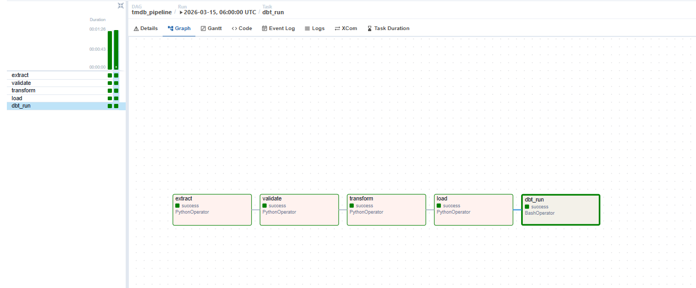
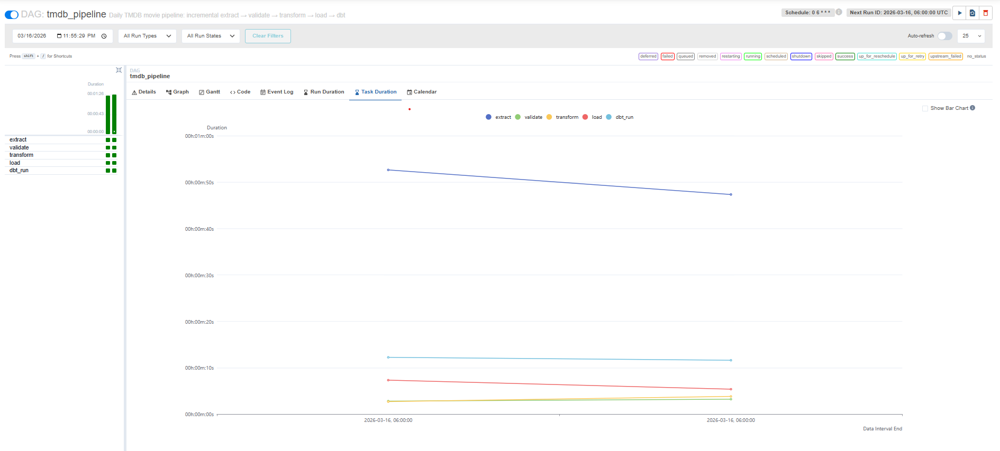
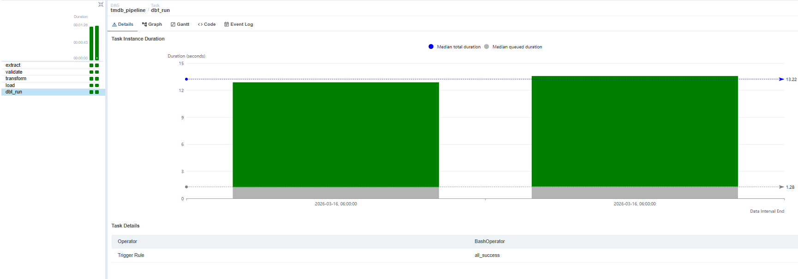

# TMDB Movie Data Pipeline


---

## Overview

End-to-end data engineering pipeline that ingests movie data from the TMDB API, stages it in AWS S3, loads it into Snowflake, and models it into a star schema using dbt. Orchestrated daily with Apache Airflow running in Docker. Initial backfill loaded **1,047,481 movies** — the pipeline now runs incrementally every 24 hours, appending new and updated movies using the TMDB changes endpoint.


---

## Architecture
```
TMDB API → extract.py → S3 raw/movies/YYYY-MM-DD/batch_XXXX.json
         → validate.py → S3 staged/movies/YYYY-MM-DD/batch_XXXX.json
         → transform.py → S3 processed/movies/YYYY-MM-DD/movies.parquet
         → load.py → Snowflake TMDB.RAW.stg_movies (COPY INTO)
         → dbt → TMDB.ANALYTICS.fact_movies + 4 dims
```

**Medallion architecture:** raw → staged → processed → analytics

---

## Project Structure
```
tmdb-pipeline/
├── pipeline/
│   ├── extract.py        # Async API extraction with checkpointing
│   ├── validate.py       # Data quality validation layer
│   ├── transform.py      # JSON flattening and Parquet serialization
│   ├── load.py           # Snowflake bulk load via COPY INTO
│   └── utils.py          # Shared S3 utilities
├── tmdb_dbt/
│   ├── models/
│   │   ├── staging/      # Source views on top of stg_movies
│   │   └── marts/        # fact_movies + 4 dimension tables
│   └── macros/           # Custom schema name generation
├── dags/
│   └── tmdb_pipeline.py  # Airflow DAG definition
├── tests/
│   ├── test_extract.py   # Unit tests for incremental extraction
│   ├── test_transform.py # Unit tests for JSON flattening
│   └── test_validate.py  # Unit tests for data quality rules
├── docs/
│   └── architecture.md   # Detailed architecture walkthrough
├── Dockerfile            # Airflow container
├── Dockerfile.dbt        # Lightweight dbt container
├── docker-compose.yml    # Multi-container orchestration
└── config.py             # Environment variable management
```

---

## Tech Stack

| Tool | Purpose |
|------|---------|
| Python 3.12 | Pipeline development |
| aiohttp / asyncio | Async concurrent API extraction |
| AWS S3 | Cloud object storage (medallion layers) |
| Apache Parquet | Columnar format optimized for Snowflake ingestion |
| Snowflake | Cloud data warehouse |
| dbt 1.11 | Dimensional modeling, testing, documentation |
| Apache Airflow 2.10 | DAG orchestration and scheduling |
| Docker | Multi-container pipeline isolation |
| pytest | Unit testing with mocking |

---

## Pipeline Stages

### Extract
Downloads the full TMDB movie catalog using the daily ID export file, then fetches full movie details concurrently using `aiohttp` with 50 simultaneous requests governed by an `asyncio.Semaphore` for rate limiting. Checkpointed to S3 after every 10,000-movie batch so extraction is fault-tolerant and resumable mid-run.

For daily incremental runs, the TMDB `/movie/changes` endpoint is used to fetch only movies added or modified in the last 24 hours — typically a few hundred to a few thousand records per day. Pagination is handled synchronously before the async event loop starts, keeping the event loop unblocked.

### Validate
Enforces data quality rules on every record: required field presence (`id`, `title`, `release_date`), correct data types, valid value ranges (`vote_average` 0–10, non-negative `runtime`), release date format conformance, and cross-batch duplicate detection via a `seen_ids` set. Passing records are written to the staged S3 prefix; failures are logged with breakdown by reason.

### Transform
Flattens nested JSON arrays (genres, spoken languages, production companies, production countries) into pipe-delimited strings for columnar storage. Writes a single Parquet file per run to the processed S3 prefix using PyArrow — optimized for Snowflake's native Parquet reader.

### Load
Uses Snowflake's `COPY INTO` command to bulk load the Parquet file directly from S3 into `TMDB.RAW.stg_movies`. New records are appended on each incremental run — historical data is never truncated. Load results are inspected row-by-row and an exception is raised if any rows fail to load.

### dbt
Builds a star schema in `TMDB.ANALYTICS` from `stg_movies` using Snowflake's native `LATERAL FLATTEN` for array expansion. 14/14 schema tests pass on every run. The dbt container runs in isolation from Airflow, called via `docker exec` from a `BashOperator`.

---

## Data

| Metric | Value |
|--------|-------|
| Total movie IDs in TMDB export | 1,168,284 |
| Movies extracted and loaded | 1,047,481 |
| Failed validation | 120,803 |
| Primary failure reason | Missing `release_date` (99.9%) |
| Duplicate IDs caught | 4 |
| S3 batch files | 117 |
| pytest tests passing | 28/28 |
| dbt schema tests passing | 14/14 |

---

## Snowflake Schema

### TMDB.RAW
- `stg_movies` — flat staging table loaded via COPY INTO from Parquet

### TMDB.ANALYTICS (built by dbt)

| Table | Rows |
|-------|------|
| `fact_movies` | 1,060,855 |
| `dim_genre` | 19 |
| `dim_language` | 179 |
| `dim_release_date` | 44,102 |
| `dim_production_company` | 200,091 |

---

## Airflow DAG

The `tmdb_pipeline` DAG runs daily at 06:00 UTC with `catchup=False`. On each scheduled run, Airflow passes the execution date via the `{{ ds }}` macro so each stage automatically processes the correct date partition.
```
extract → validate → transform → load → dbt_run
```





---

## Docker


The pipeline runs in two isolated containers:

- **Airflow** — `apache/airflow:2.10.2` base image running the webserver and scheduler
- **dbt** — lightweight `python:3.12-slim` image with only `dbt-snowflake` installed

Keeping dbt in a separate container avoids dependency conflicts with Airflow and reflects production best practices for service isolation. The Airflow `BashOperator` calls `docker exec` into the dbt container at runtime, with the Docker socket mounted into the Airflow container.

---

## Engineering Challenges

**Async extraction at scale** — Fetching detail for 1.1M movies sequentially would have taken days. The solution was an `asyncio` event loop with `aiohttp` firing 50 concurrent API requests, governed by a `Semaphore` to avoid rate limiting. The full backfill completed in hours instead.

**Fault-tolerant checkpointing** — A long-running extract risks losing progress on network failure or system interruption. After every 10,000-movie batch, a JSON checkpoint is written to S3 recording how many movies have been fetched and how many batches are complete. On restart, the extract reads the checkpoint and skips already-processed IDs.

**Incremental vs. full load** — After the initial backfill of 1,047,481 movies, re-extracting the full catalog daily would be wasteful. The TMDB `/movie/changes` endpoint returns only movies added or modified in a given date range, reducing daily extract volume from 1M+ records to a few thousand. New rows are appended to `stg_movies` and dbt rebuilds the star schema on top of the full dataset.

**Docker BuildKit on Windows** — The default BuildKit engine on Windows Docker Desktop produces intermittent `RST_STREAM INTERNAL_ERROR` failures when pulling base images. Resolved by identifying that `Dockerfile.dbt` was saved in UTF-16 LE encoding rather than UTF-8, which caused the build context to be corrupted before it reached the daemon.

---

## How to Run
```bash
# Clone the repo
git clone https://github.com/morganmicah200/tmdb-pipeline.git
cd tmdb-pipeline

# Set up environment
python -m venv .venv
.venv\Scripts\activate
pip install -r requirements.txt

# Configure credentials
cp .env.example .env
# Fill in TMDB_API_KEY, AWS credentials, Snowflake credentials

# Start Docker
docker-compose up -d

# Trigger pipeline
# Open http://localhost:8080 — admin/admin
# Toggle tmdb_pipeline DAG on and trigger manually
```

---

## Author

Micah Morgan — [GitHub](https://github.com/morganmicah200)
